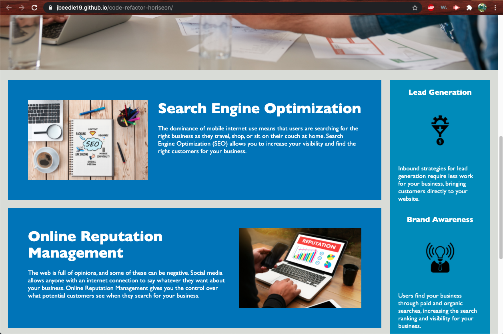

Challenge One: Code Refactor

Description:
This project is a browser page for the marketing group Horiseon with the CSS styling. It has been edited to be more accessible, the HTML and CSS have been cleaned up to be more organized and comments were added. Broken links were fixed and a title was added to page. 

Screenshots:

Link:
https://jbeedle19.github.io/code-refactor-horiseon/
